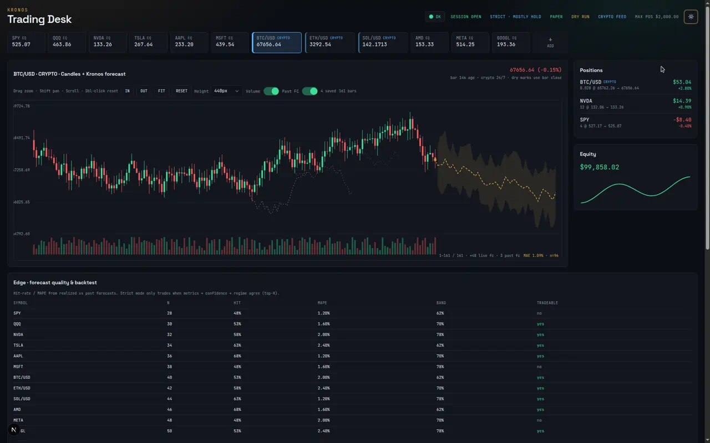
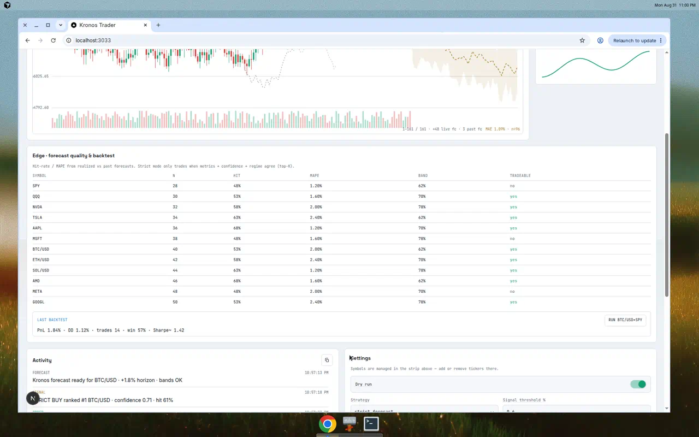
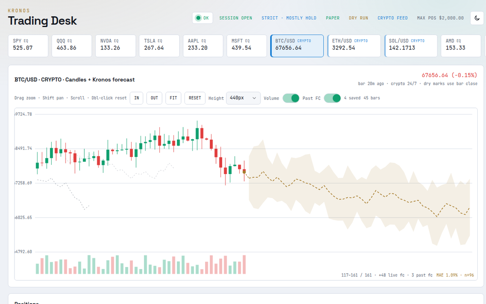
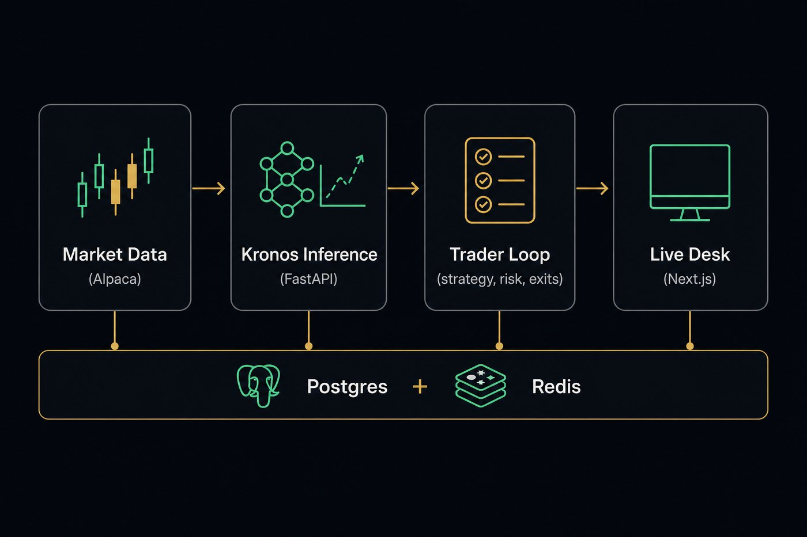
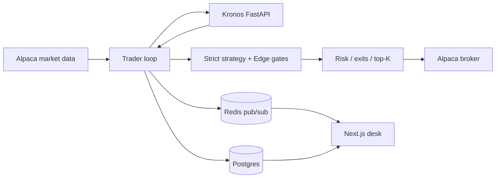

<p align="center">
  
</p>

<h1 align="center">Kronos Trader</h1>

<p align="center">
  <strong>AI candlestick forecasts → strict strategy → paper (or live) orders → real-time trading desk.</strong>
</p>

<p align="center">
  <a href="#quick-start"></a>
  <a href="LICENSE"></a>
  <a href="#safety-first"></a>
</p>

<p align="center">
  
  
  
  
  
  
</p>

---

**Kronos Trader** is a full-stack autonomous paper-trading system built around [Kronos](https://github.com/shiyu-coder/Kronos) — an open-source foundation model for financial candlesticks. Forecasts are gated by confidence bands, hit-rate / MAPE metrics, regime filters, and top-K ranking before any order is sized or sent to Alpaca.

> **Default is paper + dry-run.** Live trading requires an explicit, conscious env change. This is a research / engineering portfolio project — not financial advice.

## Why this exists

Most “AI trading” demos stop at a chart. This one closes the loop:

| Layer | What you get |
|------|----------------|
| **Inference** | Kronos OHLCV forecasts with multi-sample confidence bands |
| **Edge** | Hit-rate, MAPE, band coverage, tradeable gates, cost-aware backtests |
| **Strategy** | `strict_forecast` — mostly HOLD; only ranked high-confidence entries |
| **Risk & exits** | Position / portfolio caps, stop-loss flatten, take-profit fraction |
| **Execution** | Alpaca stocks + 24/7 crypto, paper or live |
| **Desk** | Live Next.js UI — candles, gold forecast overlay, Edge panel, settings |

## Screenshots

<p align="center">
  
  <br />
  <em>Edge panel: hit-rate, MAPE, tradeable gates, and the last cost-aware backtest.</em>
</p>

<p align="center">
  
  <br />
  <em>Light theme for daytime desks — same layout, different atmosphere.</em>
</p>

## Architecture

<p align="center">
  
</p>



| Service | Role |
|---------|------|
| `apps/inference` | FastAPI + Kronos (`mini` / `small` / `base`) |
| `apps/trader` | Loop: bars → forecast → strict strategy → exits → top-K → Alpaca; WebSocket fanout |
| `apps/dashboard` | Live desk — candles, gold forecast overlay, Edge metrics, settings |
| Postgres / Redis | Persistence + realtime events |

## Features

- **Strict-by-default strategy** — path + confidence bands + forecast-quality gate + regime + ranked top-K; intentionally quiet
- **Forecast Edge panel** — hit-rate, MAPE, band coverage, tradeable flags, last cost-aware backtest
- **Mixed book** — US equities/ETFs and Alpaca crypto pairs (`BTC/USD`, …) with market-hours awareness
- **Hard risk brakes** — per-symbol and portfolio notional caps, stop-loss flatten, long-only sells
- **Live controls** — change symbols, thresholds, risk, and dry-run from the desk without restarting
- **Paper-first safety** — dry-run + paper endpoints until you flip two env flags on purpose
- **Docker Compose** one-command stack, plus local PowerShell helpers for Windows

## Quick start

### Docker (recommended)

```bash
git clone --recurse-submodules https://github.com/robintrepte/kronostrader.git
cd kronostrader
cp .env.example .env
# Optional: ALPACA_API_KEY=... and ALPACA_SECRET_KEY=...
# MOCK_MARKET_DATA=true works without Alpaca keys

docker compose -f infra/docker-compose.yml --env-file .env up --build
```

| Surface | URL |
|---------|-----|
| Dashboard | http://localhost:3033 |
| Trader API / WS | http://localhost:8001 |
| Inference health | http://localhost:8000/health |

First inference boot downloads Hugging Face weights (can take several minutes).

### Local services

Postgres + Redis via Compose, apps on the host (root `.env` is loaded automatically):

```powershell
# infra
docker compose -f infra/docker-compose.yml --env-file .env up postgres redis -d

# one terminal per service
.\scripts\dev.ps1 inference   # :8000
.\scripts\dev.ps1 trader      # :8001
.\scripts\dev.ps1 dashboard   # :3033
```

On Windows networks that break HF downloads inside Python, run `.\scripts\download-kronos.ps1` once so inference can load weights from disk.

Smoke the model:

```bash
python apps/inference/scripts/smoke_predict.py --url http://127.0.0.1:8000
```

Cost-aware backtest:

```bash
cd apps/trader
python scripts/run_backtest.py --symbols "BTC/USD,SPY" --max-steps 24
```

Results → `apps/trader/data/backtest_last.json` and `GET /api/backtest/last` (Edge panel).

## Configuration highlights

See [`.env.example`](.env.example). Important knobs:

| Variable | Default | Meaning |
|----------|---------|---------|
| `ALPACA_PAPER` | `true` | Paper trading endpoint |
| `ALPACA_LIVE` | `false` | Live only if `true` **and** `ALPACA_PAPER=false` |
| `DRY_RUN` | `true` | Compute signals; do not submit orders |
| `MOCK_MARKET_DATA` | `false` | Synthetic bars (no Alpaca keys) |
| `KRONOS_MODEL_SIZE` | `base` | `mini` / `small` / `base` |
| `STRATEGY` | `strict_forecast` | or legacy `forecast_momentum` |
| `SAMPLE_COUNT` | `4` | Kronos samples → confidence bands |
| `TOP_K_ENTRIES` | `3` | Max new buys per loop cycle |
| `MAX_POSITION_SIZE` | `2000` | Per-symbol notional (USD) |
| `MAX_PORTFOLIO_EXPOSURE` | `25000` | Book notional cap |
| `STOP_LOSS_PCT` | `2.0` | Flatten when unrealized ≤ −threshold |

### Safety first

1. Confirm you understand real capital is at risk.  
2. Set `DRY_RUN=false`.  
3. Set `ALPACA_PAPER=false` **and** `ALPACA_LIVE=true`.  
4. Double-check risk limits.  
5. Restart trader and verify logs show `LIVE TRADING ENABLED`.

## Monorepo layout

```
apps/dashboard    Next.js trading desk
apps/inference    Kronos FastAPI service
apps/trader       Trading loop + risk + WebSocket API
packages/ui       Shared chart / panel primitives
packages/shared-types
infra/            Docker Compose + Hetzner deploy notes
docs/assets/      README screenshots
scripts/          Dev helpers + demo snapshot server
```

Production notes: [`infra/hetzner/DEPLOY.md`](infra/hetzner/DEPLOY.md).

## Stack

- **Model:** [NeoQuasar / Kronos](https://huggingface.co/NeoQuasar) (AAAI 2026)
- **Broker:** [Alpaca](https://alpaca.markets/) stocks + crypto
- **Backend:** FastAPI, asyncio trading loop, Postgres, Redis
- **Frontend:** Next.js, TypeScript, Tailwind, shadcn-style controls
- **Ops:** Docker Compose, optional Hetzner + nginx TLS

## License

Application code is **MIT** — see [LICENSE](LICENSE).

Kronos model code under `apps/inference/vendor/kronos` follows its [upstream license](https://github.com/shiyu-coder/Kronos).

---

<p align="center">
  <sub>Built as a portfolio system: forecast → measure edge → trade only when the gates agree.</sub>
</p>
